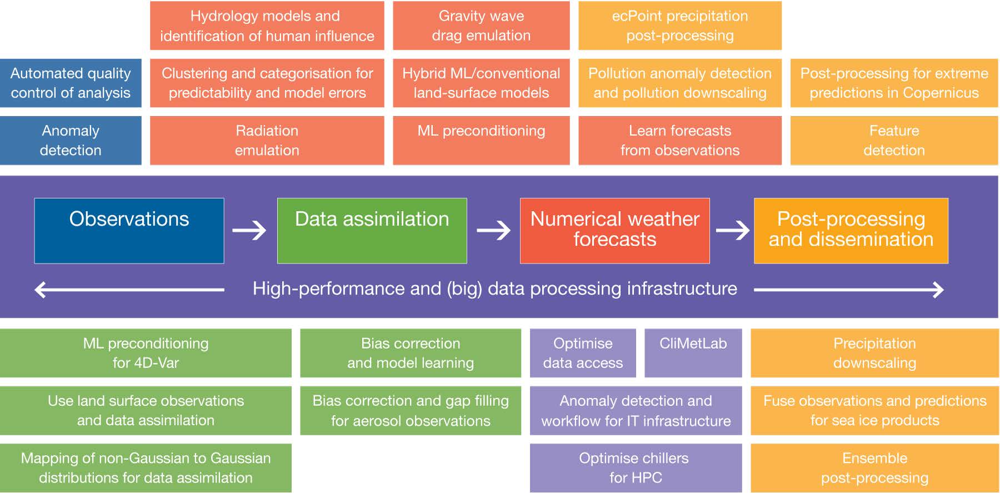

目前已有研究方向：

- 基于模式预测数据构建神经网络模式进行预测订正
- 基于历史观测数据构建神经网格模型进行降水预测

基于数值预报技术的现代天气预报流程：

- 数据获取和预处理
- 模式资料同化
- 模式集合预报
- 预报结果后处理

提高天气预报的准确性：

- 提高时空分辨率
  - 将分辨率的网格精度从千米级提升到百米级
- 模拟更接近真实环境的生物、地球、物理、化学过程
  - 采集更多的观测数据和开发更精细的气候模式

科学计算范式： 人工智能+高性能计算

Markus Reichstein等在Nature上发表了《“数据驱动型”地球系统科学领域的深度学习及其过程理解》提出：

- 将物理模型和机器学习结合起来以提升天气和气候预测能力。

观测数据处理方面:

- 机器学习用于数据质量控制和异常检测

数据同化方面：

- 用于误差订正和数据分布由非高斯分布向高斯分布的转换

数值预报方面：

- 机器学习代替某些参数化方案，建立机器学习-传统物理模式混合模式。

后处理方面：

- 用于降水尺度、观测和模式预报融合、集合预报后处理、极端降水处理以及特征检测等。

# ECMWF机器学习路线图2021-2030

## 正文

  数值天气预报和气候服务领域的科学家正探索人工智能 (Artificial Intelligence, AI) 和机器学习 (Machine Learning, ML) 的新能力将会如何改变未来的地球系统科学。 但是，研究的范围和速度也带来一些严峻的挑战：

  - 需要建立必要的专门知识
- 需要开发软件和硬件基础设施
- 在预报工作流中将机器学习方法与传统模型集成

机器学习ML：

- 机器学习是对计算机算法的研究，这些算法通过对数据的学习而自动进行改进，无需进行显式编程。 机器学习代表与地球系统科学最相关的 AI 子集。

机器学习方法：

- 监督学习
  - 基于带标记的数据进行学习
    - 分类：在气压场中是否带有热带气旋
    - 回归： 伦敦明天预期的日降水量为2.3mm
- 非监督学习
  - 基于非标记的数据区分数据样本
    - 聚类和降维

## AI和ML得到应用的原因

- 数据量越来越大
- 方法：越来越多，针对领域特定需求开发机器学习应用
- 硬件：硬件发展快，可以支持数十亿可训练参数的机器学习工具
- 开源软件：TensorFlow 和 PyTorch 的开源框架，仅需要几百行的python代码即可开发复杂的机器学习应用。

对于深度神经网络等复杂的机器学习技术，地球系统科学依然落后于其他学科

## 机器学习如何改变NWP和气候服务

ML可以用来：

- 提高天气和气候模型的计算效率
- 从数据中提取信息
- 模式后处理

ECMWF 目前正在研究或计划研究的机器学习应用

ECMWF 当前已成功的尝试包括：

- 资料同化：SMOS 土壤水分陆面资料同化中使用神经网络 (Rodríguez-Fernández et al., 2019)，弱约束 4D-Var 框架中的神经网络 (Bonavita and Laloyaux, 2020)
- 模式：深度学习用于重力波拖曳参数化方案 (Chantry et al., 2021)，深度学习模拟器可用于生成切线性伴随 4D-Var 数据同化的模式代码 (Hatfield et al., 2021)
- 后处理：决策树用于降水集合预报 (Hewson and Pillosu, 2020)
- 监控：使用机器学习检测 ECMWF 数据服务日志中的异常，属于 ECMWF Summer of Weather Code 2020 中的一个项目

## 挑战与应对

### 领域：

ML：通过优化特定目标函数（例如48小时降水RMSE减少）解决数据科学问题
Earth：通过物理解释和检查物理一致性（例如守恒定律或过程反馈）提高和验证模型

相关领域科学家在 ML 方面有时会采取防御措施，因为他们将新功能视为威胁而不是对自己工具箱的扩展。 部分领域科学家不信任没有物理解释的黑盒模型 (black box)，当前应用的机器学习模型为其它领域开发，无法在模型设计阶段引入领域知识。

### 应对：

合作开发用于业务的物理一致的 ML 解决方案，充分利用高级 ML 新工具箱的全部潜力，补充现有基于物理的解决方案。

Explainable AI 和 physics-informed machine learning 试图将 ML 与物理知识相结合，以实现物理上更一致的解决方案 (McGovern et al., 2019; Reichstein et al., 2019)。

将探索 trustworthy AI，增进我们对机器学习方法工作方式的理解，为黑盒提供一些启示。

### 定制解决方案：

地球系统科学中的一些机器学习应用与其他领域应用的机器学习方法在概念上非常相似，例如在模式输出中识别热带风暴可以当成一个图像识别任务。

但许多任务需要定制化的机器学习解决方案 (customised machine learning solution)。 例如：

**水平网格：**

- 物理场可能是不规则的网格，无法在空间和时间范畴内直接简单应用卷积，而这种卷积是很多机器学习方法的核心元素。

**垂直结构：**

- 虽然大气的垂直维度是结构化的，但物理场在地面和模式层顶依然显示非常不同的动力特征，同样无法使用标准的卷积方法。

**物理约束：**

- 物理场需要遵循物理约束，例如守恒定律，或限制为正值 (例如降水)

### 应对

面向领域特定问题开发定制化的机器学习解决方案，例如在神经网络中对不规则网格进行卷积。 定制方法可以作为基准解决方案 (benchmark solution)，适用于不同的机器学习应用。

构建定制方案的最快速路径是开发基准数据集和问题，包括：

### 数据集

代价函数
示例解决方案
允许来自不同团体和机构的机器学习科学家对机器学习解决方案进行定量比较 (例如 WeatherBench in Rasp et al., 2020)。

### 观测

机器学习模型不仅应用于模拟或加速模式组件，但也应该用于改进模式。 通常需要从地球系统观测中训练机器学习工具，也就是将模型轨迹与相同时空物理情况的观测结果进行比较。 但很难从地球系统观测中学习，因为它们稀疏、不规则、不确定，从多种仪器 (包括卫星辐射) 中提取，通常无法直接与模式场进行比较。

### 应对

联系模式模拟和地球系统观测的最佳方式是资料同化 (data assimilation)。 ML 和 DA 有很多共同点，因此地球系统科学的 ML 应在许多情况下适应 DA 的工作流 (Geer, 2021)。 例如：

- 使用观测误差表示不同程度的不确定性
- 使用观测算子将规则模式网格映射到不规则网格
- 观测稀疏化
- 使用物理组件或层将物理约束强加于其它机器学习网络上

已经有许多有趣的机器学习应用，与结构化数据集一起使用，可以改善对观测结果的处理 (例如使用观测算子) 和资料同化 (例如通过学习模型或观察误差)。

需要密切关注当前对卫星观测映射到地表的改进 (通常基于机器学习)，因为它们为提高陆面参数化提供了新机会，可以作为地球表面附近大气动力的参考值。

机器学习对于从物联网 (Internet of Things, IoT) 和其他数据源提取信息非常必要，可以补充当前的地球观测。 例如

- 交通流量
- 能源生产
- 运输分析

物联网数据通常比较嘈杂，但可用量非常大，因此很难使用常规方法进行处理。

### 数据

影响机器学习方法准确性的限制因素：

- 可用于训练的数据量
- 计算资源
- 数据处理基础设施

ML 用户倾向于进行数量更大和更有选择性的数据访问，例如从全球的某区域检索长时间序列的单个要素场数据。

### 工具

相对于传统方法，机器学习使用不同软件和硬件工具集。

Earth：

- 大部分基于 Fortran 代码，通常运行在基于 CPU 的超算硬件平台
- ML：通常基于 Python 代码和 Python 库，包括 Jupyter Notebooks，在 GPU 硬件平台上有最佳的训练和使用效率

监督学习的大部分计算成本由机器学习工具的训练产生，而工具的应用 (接口) 通常非常高效。

作为提高代码可移植性的代码重构的一部分，模式现在被改写为特定领域的语言，在某些情况下还改写为 Python 或 Julia 代码 (Bauer et al., 2020)，包括 Finite Volume 版本的 IFS (IFS-FVM)。 但是，还需要几年的时间才能使这些进展到达大部分领域科学家。

### 集成

需要将机器学习与传统 NWP 和气候服务工作流集成的解决方案。 例如，将 Python 编写的 ML 工具与 IFS 中的 Fortran 代码集成非常困难。 而且，目前仍然没有在准备业务模式新循环时如何更新需要调整的机器学习工具的经验。

#### 应对

为了减少总体工作量，需要集中式软件解决方案，在 ECMWF 的工作流中集成机器学习和传统工具。 应用集中式解决方案时，需要为领域科学家提供支持，并且解决方案必须与 ECMWF Scalability Porject 在模式可移植性方面的工作保持一致。

## How to progress - the big picture

1、 通过机器学习提升模式效率和预测质量

2、拓展机器学习的软件和硬件设备

3、促进领域和机器学习专家之间的合作，以合并两个社区

4、发展传统的机器学习方法以解决地球系统科学

5、 培训工作人员和成员以及合作的国家用户，并组织科学会议和讲习班

简单来说就是：

- 提升模式
- 软硬件
- 合作
- 定制化解决方案
- 培训

当前地球系统模型机器学习的局限：

- 非线性系统的表示
- 黑盒方法的物理一致性
- 机器学习方法无法超越现有方法的应用领域.

## 未来五年的发展

- 聚焦机器学习的会议
- 合作机制
- 硬件
- 软件
- 内部团队
- 培训
- 数据集
- IoT 数据
- ML 工作流
  - 数据检索
  - 数据预处理
  - 机器学习训练
  - 模型评估
  - IFS 内的接口
- 集成到业务工作流
- ML 加速传统模型计算效率

未来 3 年最有可能进入业务流程的机器学习领域：

- 观测资料处理 (SMOS 项目)
- 观测算子
- 资料同化中的偏差订正 (Bonavita and Laloyaux, 2020)
- 物理参数化方案的模拟，有关重力波拖曳和辐射的工作，包括生成切线性伴随模式代码
- 集合预报后处理 (Baran et al., 2020; Hewson and Pillosu, 2020; Groenquist et al., 2020)
- 作业调度或 HPC 系统异常检测
- 另外的工作还包括：

- IFS 中耦合 Fortran 代码和机器学习库的高效解决方案
- IFS 垂直方向的机器学习应用
- 非结构化立方八面体 reduced Gaussian 网格上的三维应用

## references

数据集

Rasp, S., P. D. Dueben, S. Scher, J. A. Weyn, S. Mouatadid & N. Thuerey, 2020: WeatherBench: A benchmark dataset for data- driven weather forecasting. Journal of Advances in Modeling Earth Systems, 12, e2020MS002203, https://doi.org/10.1029/2020MS002203

资料同化

Bocquet, M., J. Brajard, A. Carrassi & L. Bertino, 2020: Bayesian inference of chaotic dynamics by merging data assimilation, machine learning and expectation-maximization. Foundations of Data Science, 2(1), pp. 55-80.

Geer, A. J., 2021: Learning earth system models from observations: Machine learning or data assimilation? Phil. Trans. A. In press (preprint: https:/doi.org/10.21957/7fyj2811r).

后处理

Hewson, T. & F. Pillosu, 2020: A new low-cost technique improves weather forecasts across the world. arXiv:2003.14397v1.

Grönquist, Peter, et al., 2020: Deep Learning for Post-Processing Ensemble Weather Forecasts. Phil. Trans. A.

Vannitsem, S. et al., 2020: Statistical Postprocessing for Weather Forecasts – Review, Challenges and Avenues in a Big Data World. Bull. Am. Meteorol. Soc., doi: https://doi.org/10.1175/BAMS-D-19-0308.1

模型解释

McGovern, A., R. Lagerquist, D. John Gagne, G. E. Jergensen, K. L. Elmore, C. R. Homeyer & T. Smith, 2019: Making the Black Box More Transparent: Understanding the Physical Implications of Machine Learning. Bull. Am. Meteorol. Soc., 100, 2175–2199, https://doi.org/10.1175/BAMS-D-18-0195.1.

Reichstein, M., G. Camps-Valls, B. Stevens et al., 2019: Deep learning and process understanding for data-driven Earth system science. Nature, 566, 195–204, https://doi.org/10.1038/s41586-019-0912-1.

可能与笔者工作有关的部分按相关度从高到低排序有三项：

- 基础设施：最适合

  - 想要快速介入机器学习领域，专注数据处理，完善软件基础设施，可能是最佳的选择。

      - 自动化运维：缺乏有效的指导
      - 数据工具：搭建从原始数据到机器学习方法的数据桥梁
      - 数据平台  ：对基础平台进行二次封装，提供方便使用的数据接口。

- 2、后处理与分发：可能涉及
  - 直接体验激动人心的机器学习算法
    - 统计后处理:有较多的文献可以学习
    - 模式诊断：在ESMValTool 工具中具有统计学习的诊断方法

- 3、 观测：难度较大
  - 模式研发

数值天气预报 (Numerical weather prediction, NWP) 

# 论文原文：

- https://www.ecmwf.int/en/elibrary/19877-machine-learning-ecmwf-roadmap-next-10-years

翻译笔者博客：

- https://blog.perillaroc.wang/tags/ecmwf/

其他参考：

机器学习会替代现有的天气预报模式么？

- https://blog.perillaroc.wang/post/2019/2019-11-16-view-will-machine-learning-replace-conventional-weather-prediction-models/

Python开发使访问天气和气候数据更容易

  - https://blog.perillaroc.wang/post/2020/10/2020-10-27-view-python-developments-enable-easier-access-weather-and-climate-data/

Welcome to CliMetLab’s documentation!

ECMWF 正在开发一个名为 CliMetLab 的新 Python 包，面向使用天气和气候数据进行机器学习的数据科学家。

- https://climetlab.readthedocs.io/en/latest/

Global numerical modelling at the heart of ECMWF’s forecasts

全球数值模式是ECMWF预测的核心

- https://www.ecmwf.int/en/about/media-centre/focus/2022/global-numerical-modelling-heart-ecmwfs-forecasts

Machine Learning seminar series

- https://www.ecmwf.int/en/learning/workshops/machine-learning-seminar-series