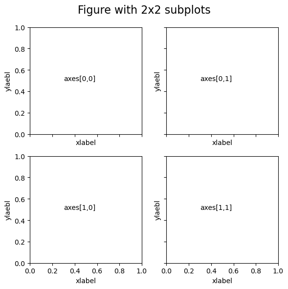

通常在阅读文献时，发现对于一些图片的绘制时，如果存在多个子图，通常为了美观、简洁，只保留最后一列的以及最左一侧的子图的刻度，那么，我们应该如何实现这种功能呢？

一般来说，在python实现多子图绘制的函数主要有两个：

- 第一种，通过`fig.add_subplot(行、列、位置)`添加

```bash
import matplotlib.pyplot as plt 
fig=plt.figure(figsize=(5,5))
subplot=fig.add_subplot(1,1,1)
```
- 第二种，通过`plt.subplots(行，列)`，将行数和列数作为参数传递给该方法，该方法返回一个图对象和轴对象，可以用来操作图形。

```bash
import matplotlib.pyplot as plt 
fig,ax=plt.subplots(2,1)
```
## 1、使用fig.add_subplot(行、列、位置)添加子图
其中，对于第一种来说，比较容易上手，只需要指定子图的具体位置即可，如下图所示：

```bash
import matplotlib.pyplot as plt 

fig=plt.figure(figsize=(8,6),dpi=100)

ax_1=fig.add_subplot(121)
ax_1.text(0.3, 0.5, 'subplot(121)')

ax_2=fig.add_subplot(222)
ax_2.text(0.3, 0.5, 'subplot(222)')

ax_3=fig.add_subplot(224)
ax_3.text(0.3, 0.5, 'subplot(224)')

fig.suptitle("Figure with multiple Subplots")
plt.show()
```

### 1.1 循环绘制子图
如果要在一个页面上显示一个2x2的四个子图，只需要添加一个循环即可：

```bash
import matplotlib.pyplot as plt 

fig=plt.figure(figsize=(8,6),dpi=100)
c=0
for i in range(4):
    c=c+1
    ax=fig.add_subplot(2,2,c)
    ax.text(0.3, 0.5, 'subplot(22'+str(c)+')')
    fig.suptitle("Figure with multiple Subplots")
plt.show()
```


## 2、使用plt.subplots(行，列)添加子图

```python
matplotlib.pyplot.subplots(nrows=1, ncols=1, *, 
sharex=False, sharey=False, 
squeeze=True, subplot_kw=None, 
gridspec_kw=None, **fig_kw)
```

但是，`plt.subplots()`与`fig.add_subplot()`相比稍微麻烦一点，但是功能也多一点，通过返回ax列表中的子图个数进行子图的绘制：

```bash
import matplotlib.pyplot as plt 

fig,ax=plt.subplots(1,2,dpi=300)

ax[0].text(0.3,0.5,"1st Subplot")
ax[0].set_xticks([])
ax[0].set_yticks([])

ax[1].text(0.3,0.5,"2nd Subplot")
ax[1].set_xticks([])
ax[1].set_yticks([])

fig.suptitle('Figure with 2 subplots',fontsize=16) 
plt.show()
```


### 2.1 循环绘制子图
对于`plt.subplots()`，如果要实现循环绘制子图，就需要双重循环：

```python
import matplotlib.pyplot as plt 

fig, axes = plt.subplots(2, 2, figsize=(6,6),dpi=100)

for i, row in enumerate(axes):
    for j, col in enumerate(row):
        axes[i,j].text(0.3, 0.5, 'axes['+str(i)+','+str(j)+']')
        
plt.tight_layout()
```


## 3、循环绘制子图时，设置共享坐标轴
那么，如何在循环绘制子图的同时，又实现共享坐标轴呢，这里就要使用到`plt.subplots()`，它提供了一个参数，可以自动实现共享坐标轴的功能，只需要在建立子图个数时添加`sharex、sharey`即可，如下所示：

```python
fig, axes = plt.subplots(3, 3, sharex=True, sharey=True, figsize=(6,6))
```
下面进行简单示范：

```python
import matplotlib.pyplot as plt 

fig, axes = plt.subplots(2, 2, sharex=True, sharey=True, figsize=(6,6),dpi=100)

for i, row in enumerate(axes):
    for j, col in enumerate(row):
        axes[i,j].text(0.3, 0.5, 'axes['+str(i)+','+str(j)+']')
        fig.suptitle('Figure with 2x2 subplots',fontsize=16) 
plt.tight_layout()
```


可以发现，已经实现了我们的需求！！
## 4、循环绘制子图时设置共享label
同样的，如果要实现共享`label`，应该怎么做呢？
这其实有两个思路：
- 通过`ax.text()`选取适当位置，进行添加
- 在绘制子图时，添加判断语句进行添加

下面，进行简单演示：
```python
fig, axes = plt.subplots(2, 2, sharex=True, sharey=True, figsize=(6,6),dpi=100)

for i, row in enumerate(axes):
    for j, col in enumerate(row):
        axes[i,j].text(0.3, 0.5, 'axes['+str(i)+','+str(j)+']')
        fig.suptitle('Figure with 2x2 subplots',fontsize=16) 
        
fig.text(0.5, 0, 'xlabel', ha='center')
fig.text(0, 0.5, 'ylaebl', va='center', rotation='vertical')
            
plt.tight_layout()
```


或者也可以如下面这样：

```python
import matplotlib.pyplot as plt 

fig, axes = plt.subplots(2, 2, sharex=True, sharey=True, figsize=(6,6),dpi=100)

for i, row in enumerate(axes):
    for j, col in enumerate(row):
        axes[i,j].text(0.3, 0.5, 'axes['+str(i)+','+str(j)+']')
        fig.suptitle('Figure with 2x2 subplots',fontsize=16) 
        col.set_xlabel('xlabel')
        col.set_ylabel('ylaebl')               
plt.tight_layout()
```


## 绘制非规则分布子图（带投影情况下）的贡献设置方式


```python
proj  =  ccrs.PlateCarree()

fig, axes = plt.subplots(4, 4, sharex=True, sharey=True, figsize=(10,9),dpi=200,
                         
                    subplot_kw={'projection':proj})

fig.tight_layout()
plt.subplots_adjust(wspace =0.26)
for i, row in enumerate(axes):
    for j, col in enumerate(row):
          
        axes[i,j].coastlines('50m')
        
        box = [100,125,0,20]
        xstep,ystep = 10,5
        axes[i,j].set_extent(box,crs=ccrs.PlateCarree())
        
        axes[-1,j].set_xticks(np.arange(box[0],box[1]+xstep, xstep),crs=ccrs.PlateCarree())
        axes[i,0].set_yticks(np.arange(box[2], box[3]+1, ystep),crs=ccrs.PlateCarree())
        lon_formatter = LongitudeFormatter(zero_direction_label=False)#True/False
        lat_formatter = LatitudeFormatter()
        axes[-1,j].xaxis.set_major_formatter(lon_formatter)
        axes[i,0].yaxis.set_major_formatter(lat_formatter)

plt.delaxes(axes[3,2])
plt.delaxes(axes[3,3])
plt.show()
```
