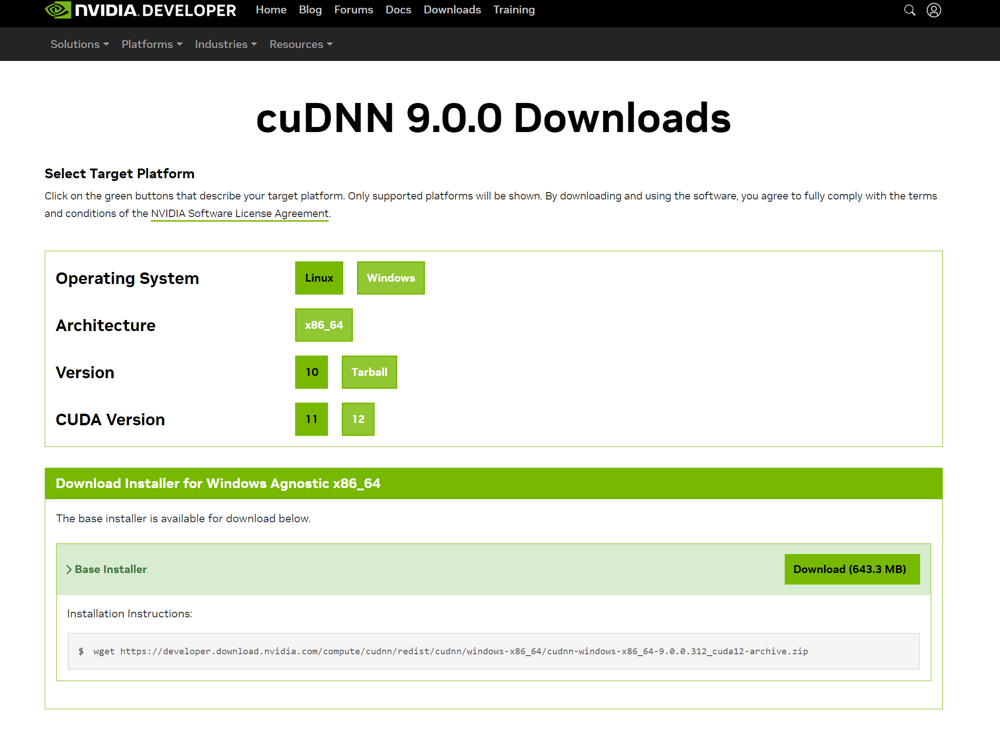
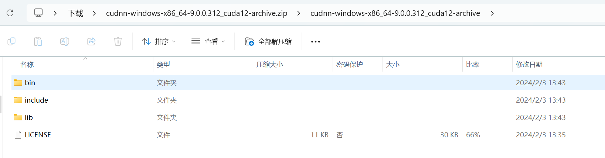
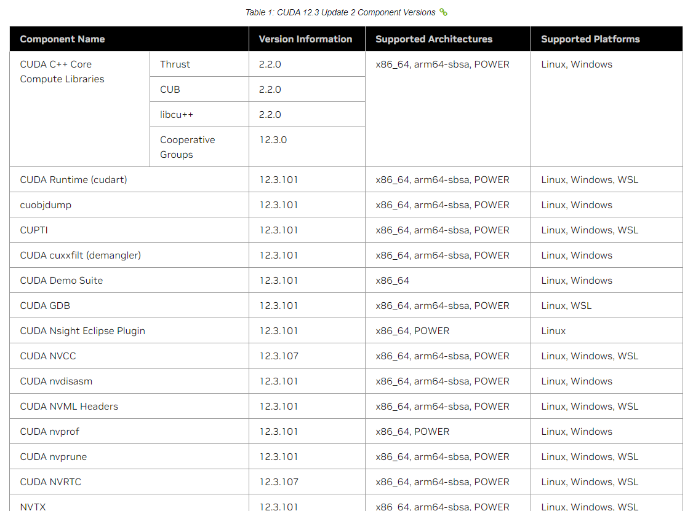
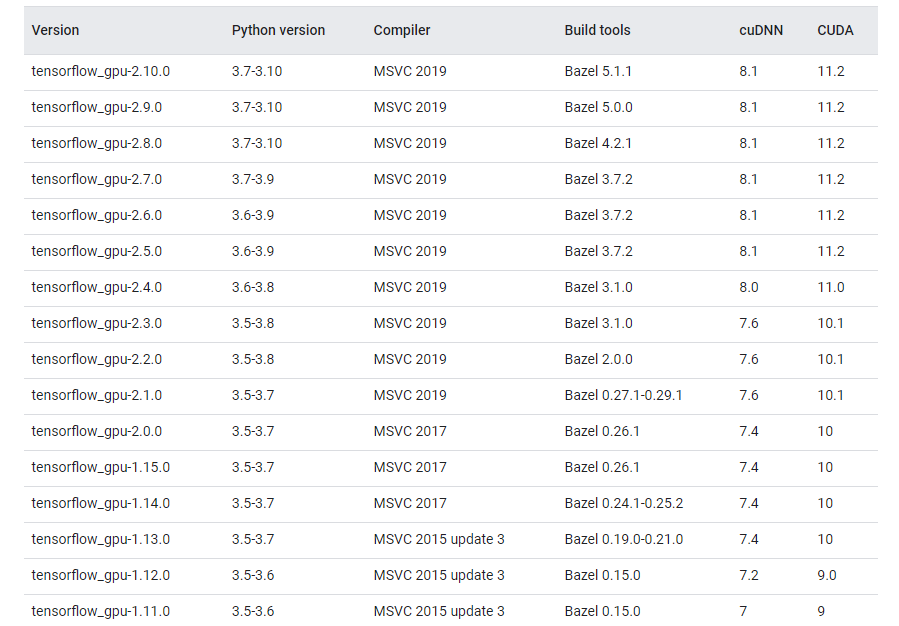

https://neptune.ai/blog/installing-tensorflow-2-gpu-guide

https://developer.nvidia.com/cudnn-downloads?target_os=Windows&target_arch=x86_64&target_version=Agnostic&cuda_version=12

follow the links:

https://medium.com/geekculture/install-cuda-and-cudnn-on-windows-linux-52d1501a8805

The instructions say

Copy bin\cudnn*.dll to C:\Program Files\NVIDIA\CUDNN\v8.x\bin.
Copy include\cudnn*.h to C:\Program Files\NVIDIA\CUDNN\v8.x\include.
Copy lib\cudnn*.lib to C:\Program Files\NVIDIA\CUDNN\v8.x\lib.

测试：

https://hackmd.io/@jerrychu/S1QvFG98h#%E5%85%88%E8%A9%A6%E8%91%97%E5%AE%89%E8%A3%9DCuda-118%E8%A9%A6%E8%A9%A6

查看cuda 支持的系统和对应的版本：

https://docs.nvidia.com/cuda/cuda-toolkit-release-notes/index.html

查看tensorflow支持的python版本：

- https://tensorflow.google.cn/install/source_windows?hl=en#gpu

